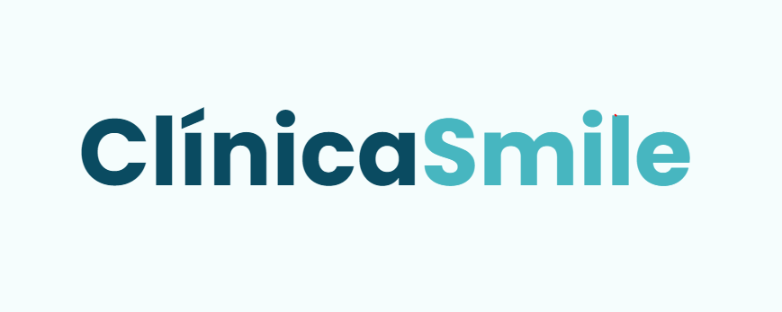

<h1 align="center">
    
     
    Clínica Smile
</h1>

<h4 align="center">
  A Responsive Dentist Website Design Using HTML CSS & JavaScript 🦷
</h4>

  <a href="#rocket-technologies">Technologies</a>&nbsp;&nbsp;&nbsp;|&nbsp;&nbsp;&nbsp;
  <a href="#information_source-how-to-use">How To Use</a>&nbsp;&nbsp;&nbsp;|&nbsp;&nbsp;&nbsp;
  <a href="#information_source-demo">Demo</a>

  

## :rocket: Technologies

This project was developed with the following technologies:

-  [HTML](https://developer.mozilla.org/pt-BR/docs/Web/HTML)
-  [CSS](https://developer.mozilla.org/pt-BR/docs/Web/CSS)
-  [JavaScrip](https://developer.mozilla.org/pt-BR/docs/Web/JavaScript)

## :information_source: How To Use

To clone and run this application, you'll need [Git](https://git-scm.com)

## :information_source: Demo

To access this application, click [here](https://ccastro01.github.io/clinica-smile)

Made with ♥ by Christian Castro :wave: [Get in touch!](https://www.linkedin.com/in/chrisdcdev/)

